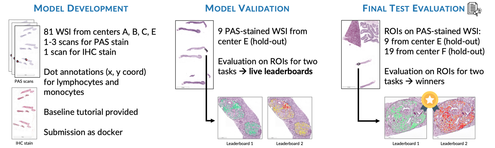
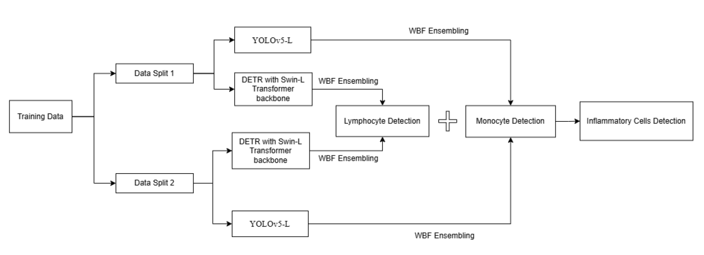
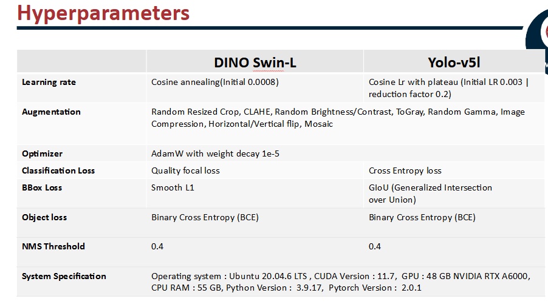

# Monkey Challenge

Objective: Detect inflammatory cells (Monocytes and Lymphocytes) in histopathology images using object detection.

Methodology: Implement object detection models to accurately localize and classify monocytes and lymphocytes in medical images.

The challenge had two different leaderboards:
Leaderboard 1: Detection of mononuclear, inflammatory cells (mononuclear leukocytes (MNLs))
Leaderboard 2: Detect and distinguish inflammatory cells: monocytes and lymphocyte

The following repo contains details of the methodology that we followed to secure 3rd rank in Monkey Grand Challenge
[Challenge](https://monkey.grand-challenge.org/)

We have also published corresponding short paper in MIDL 2025 , the paper can be found here [MIDL 2025 paper](https://openreview.net/forum?id=i9Ray4JAEn#discussion)

Following are details of technique that we have utilized for getting good scores on Lymphocytes/Monocytes and inflammatory cell detection

We have used following hyperpaprameters

To test our code you can follow below steps
1. Unzip yolov5.7x
2. Unzip mmdetection.7z
3. Download models from https://drive.google.com/drive/folders/1L4mGp67kDjjcb98EOGoRbG0FXqBwd3XS?usp=sharing  and keep it inside model folder
4. create test folder with inputimages and output folder
5. build inference docker using ./test_run.sh
6. to train model, build docker using docker_main, Go inside docker using run command and then run MMDet_Tutorial1.ipynb

